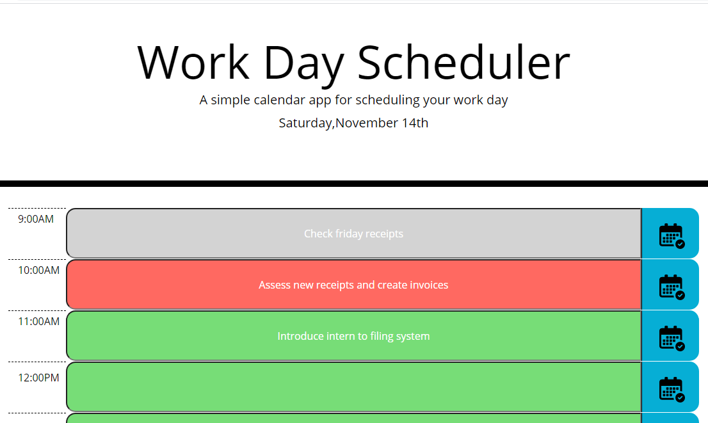

# 05 Third-Party APIs: Work Day Scheduler
This is a simple daytime planner application that allows the user to save events for each hour of the day. This app will run in the browser and feature dynamically updated HTML and CSS powered by jQuery.

Moment.js library is in use to work with date and time.

Acceptance Criteria
This is daily planner helps the user create a schedule.
When the app is accessed the user is presented with the current day displayed at the top of the calendar.
The user can scroll down to view each time-block, standardized to normal business working hours (9AM - 5PM)
The day planner is color coded to indicate past, current and future time-blocks.
Past time-blocks appear grey while the current timeblock is red, and the future time-blocks are green.
The user can click within a time-block to input text to specify an event.
The calendar icon at the end of timeblock can be used to save the text to local storage.

When the users refresh the pages, the saved events are presented.

The following image demonstrates the application functionality:

## Links

* Work Day Scheduler URL:  https://jmasaviru.github.io/Work-Day-Scheduler/

* Work Day Scheduler GitHub repository: (https://github.com/jmasaviru/Work-Day-Scheduler)
